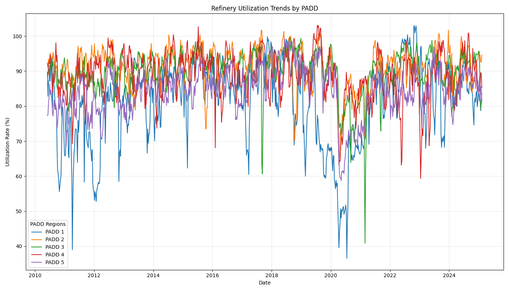

# U.S. Refinery Utilization Analysis

[](https://opensource.org/licenses/MIT)

## Overview

This project provides an analytical dashboard for U.S. refinery utilization, leveraging data from the U.S. Energy Information Administration (EIA). The analysis covers the entire U.S. refining system and individual Petroleum Administration for Defense Districts (PADDs), offering insights into refinery capacity utilization trends and volatility.

By leveraging Python, the project automates data retrieval, processing, and visualization, making it an efficient tool for understanding refinery performance over time.

## Key Features

- **Automated Data Retrieval**: Fetches weekly refinery utilization data from the EIA API
- **Time-Series Analysis**: Tracks refinery utilization trends from 2010 to present
- **Volatility Analysis**: Measures fluctuations in refinery utilization rates across PADD regions
- **Comparative Insights**: Highlights differences in refinery performance across key regions
- **Custom Visualizations**: Provides clear graphical representations of utilization trends and volatility

## Dashboard Visualizations

### U.S. and PADD Refinery Utilization Trends


### Regional Comparisons


### Individual PADD Trends

<table>
<tr>
<td></td>
<td></td>
</tr>
<tr>
<td></td>
<td></td>
</tr>
<tr>
<td></td>
<td></td>
</tr>
</table>

## Methodology

### Data Processing
1. Fetches weekly utilization data for the U.S. and PADDs
2. Cleans and formats data for consistency
3. Calculates 4-week moving averages and volatility bands
4. Generates comparative visualizations

### Data Source
- **U.S. Energy Information Administration (EIA)**: Data is sourced via the EIA API, ensuring up-to-date and reliable insights

## Implementation Example

```python
import requests
import pandas as pd
import matplotlib.pyplot as plt
import logging
from datetime import datetime
import os

# Set up logging
logging.basicConfig(level=logging.INFO)
logger = logging.getLogger(__name__)

api_key = os.getenv('EIA_API_KEY')
series_ids = {
    'U.S. Total': 'WPULEUS3',
    'PADD 1': 'W_NA_YUP_R10_PER',
    'PADD 2': 'W_NA_YUP_R20_PER',
    'PADD 3': 'W_NA_YUP_R30_PER',
    'PADD 4': 'W_NA_YUP_R40_PER',
    'PADD 5': 'W_NA_YUP_R50_PER'
}

base_url = "https://api.eia.gov/v2/petroleum/pnp/wiup/data/"
dfs = {}

for name, series_id in series_ids.items():
    url = f"{base_url}?api_key={api_key}&frequency=weekly&data[0]=value&facets[series][]={series_id}&sort[0][column]=period&sort[0][direction]=desc&offset=0&length=5000"
    response = requests.get(url).json()
    df = pd.DataFrame(response['response']['data'])[['period', 'value']]
    df.columns = ['Date', 'Utilization_Rate']
    df['Date'] = pd.to_datetime(df['Date'])
    df['Utilization_Rate'] = pd.to_numeric(df['Utilization_Rate'], errors='coerce')
    df['4W_MA'] = df['Utilization_Rate'].rolling(window=4).mean()
    df['Volatility'] = df['Utilization_Rate'].rolling(window=4).std()
    dfs[name] = df
```

## Applications

- **Market Analysis**: Identifying refinery bottlenecks and capacity constraints
- **Risk Management**: Assessing operational volatility in refining infrastructure
- **Trading Insights**: Understanding supply disruptions and seasonal refinery patterns
- **Policy & Infrastructure Planning**: Evaluating refinery utilization trends for investment decisions

## Future Development

- **Forecasting Models**: Implement predictive analytics for refinery utilization
- **Integration with Crude Oil Prices**: Correlate refinery utilization with oil market dynamics
- **Expanded Geographical Coverage**: Include international refinery utilization metrics

## Author

Antonio Pavolini

## License

This project is open-source under the MIT License.
